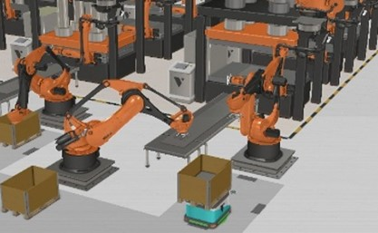
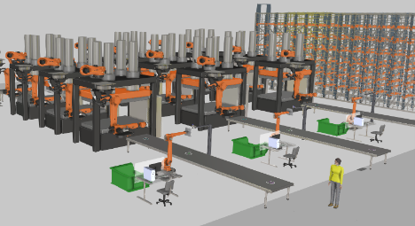

This folder includes the digital model of an industrial plant scenario. In particular, the implemented digital model represents a steel sheet pressing plant dedicated to the manufacturing of automobile doors. The model has been implemented using Visual Components [1]. 

# Folder Content

This folder is organised as follows:

```text
.
├── plant_layout                                         # Visual Components digital model of the plant
├── figures/                                        # Figures used in the README
└── README.md
```

# Industrial Plant Scenario

The implemented digital model represents a steel sheet pressing plant dedicated to the manufacturing of automobile doors and is implemented using Visual Components: `plant_layout`.

The plant is organized into three main areas: a storage warehouse for steel sheets prior to production, a production area comprising three parallel press lines, and a shipping warehouse where the finished products are stored. Automated Guided Vehicles (AGVs) transport steel sheets from the storage warehouse to the press lines for processing. At the end of each production line, the processed material undergoes a quality control procedure, during which defective products are discarded. Products that successfully pass the quality inspection are collected by human operators and arranged into boxes. A forklift then transports these boxes to the shipping warehouse. In addition, the plant features a centralized monitoring system that collects status and operational data from the entire facility. Figure 1 provides an overview of the industrial plant, including a detailed view of a single production line and an AGV delivering materials to a press line.


<p align="center">
  
</p>

<p align="center">
  <em>(a) Plant overview.</em>
</p>

<p align="center">
  
</p>

<p align="center">
  <em>(b) AGV transporting material.</em>
</p>

<p align="center">
  
</p>

<p align="center">
  <em>(c) Press line and quality control.</em>
</p>

<p align="center">
  <em>Figure 1. Industrial production plant.</em>
</p>


The plant was modeled using Visual Components [1]. The scenario is based on a layout available in the Visual Components catalogue, which represents a real production line consisting of three sequential presses used to shape steel sheets for automobile door manufacturing. This original layout was extended to include three parallel production lines, a quality control system at the end of each line, dedicated warehouse areas, and the use of AGVs to transport materials, resulting in a comprehensive representation of a full-scale production facility.

## Storage Warehouse

The storage warehouse holds the steel sheets prior to production. The material is stored in two racks, each measuring 13 × 6.4 meters. Each rack consists of 84 individual storage cells, each equipped with a sensor that generates a message whenever the cell transitions from occupied to empty, or vice versa. These messages are received by the Warehouse Management System (WMS), a software application responsible for monitoring and managing warehouse operations. The WMS controls a crane that retrieves steel sheets from the storage cells when material is requested by the production lines. Once retrieved, the crane places the steel sheets onto a conveyor, which transports them to a designated pickup area. From there, AGVs collect the material and deliver it to the production lines. The plant operates with *N* AGVs, which are coordinated by an AGV controller.

## Production Area

The production area consists of three identical press lines. Each line is equipped with three presses that shape steel sheets for the manufacturing of automobile doors. Every line includes two material delivery areas where AGVs unload the steel sheets to supply the production process. Two robotic arms, one assigned to each delivery station, load the steel sheets onto a conveyor that feeds the first press. A robotic arm located at the end of the conveyor loads the steel sheet into the first press, thereby initiating the pressing sequence. Upon completion of each pressing stage, robotic arms positioned between consecutive presses transfer the partially processed steel sheet to the next press along the line.

After the final pressing operation in the third press, a robotic arm places the manufactured steel sheet onto a conveyor that transports it to the quality inspection area. A high-resolution camera captures images of the manufactured steel sheet, which are analyzed in real time by the quality control system to detect surface defects or inconsistencies. If a defect is identified, a robotic arm removes the faulty sheet and places it into a disposal container. Steel sheets that pass the quality inspection continue along the conveyor to the end of the line, where human operators collect and store them in boxes. Once the boxes are filled, a forklift operated by a human driver transports them to the shipping warehouse.

## Shipping Warehouse

The manufactured steel sheets are organized and stored in two racks within the shipping warehouse. This warehouse has the capacity to store up to 240 boxes of finished products and is also managed by a WMS. As in the storage warehouse, the storage cells are equipped with sensors that are triggered whenever a cell transitions from empty to occupied or vice versa. This information is collected by the WMS, which maintains an up-to-date view of the occupancy status of the shipping warehouse.

The forklift deposits the boxes containing the manufactured steel sheets onto a conveyor, which transports them to the crane loading area. The WMS then instructs the crane to transfer each box to an available empty storage cell. This entire process is autonomously managed by the WMS through the integration of sensors along the conveyor and within the storage cells, as well as continuous status information exchange between these components and the WMS.

## Centralised Monitoring System

The plant is equipped with a Centralised Monitoring System (CMS) that periodically receives status and operational data from all components of the facility. This system enables plant managers to monitor real-time operations and supports data-driven decision-making through historical data analysis. Specifically, each warehouse’s WMS, the AGV controller, the controllers of the robotic arms and presses, and the quality control system report status and operational metrics to the CMS.

## Industrial Layout Parameters

**Table I. Industrial layout parameter configuration.**

| Variable | Value |
|---------|-------|
| Plant dimensions | 42 m × 56.11 m × 8 m |
| Storage warehouse shelves | 120 (6 tiers × 20 bays) |
| Shipping warehouse shelves | 84 (6 tiers × 14 bays) |
| AGV velocity | 1.5 m/s |
| AGV path length | 19.3 – 44.1 m |
| Conveyor velocity | 0.2 m/s |
| Press times | 1 s (extend) – 3 s (hold) – 2 s (retract) |
| Defective sheet rate | 5% |

# References

[1] Visual Components. *Visual Components website*. https://www.visualcomponents.com

