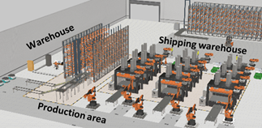

# Smart Manufacturing Dataset

This repository has been created in an anonymized form to support the peer review process of a manuscript currently under review.

The datasets provided here are part of the work presented in the submitted paper. In accordance with the double-anonymized review requirements of the journal, all information that could reveal the identity of the authors has been intentionally omitted.

Once the review process is completed, the repository will be updated to include full author information and any additional relevant details.

## Overview

This repository provides open industrial datasets that capture the data generated across an entire plant, together with the identity, position (including mobile nodes), and operational state of the plant components. The datasets were generated using a detailed digital model of an industrial plant developed in Visual Components [1], that is also available in this repository. The model simulates all production processes, material flows, and machine interactions over 24-hour production cycles. Multiple datasets are provided for scenarios with varying numbers of AGVs transporting materials within the plant, under both normal operating conditions and abnormal situations, such as AGV malfunctions that disrupt production and affect data generation. 

These datasets accompany the paper:

Anonymous, "Open Industrial Datasets for Data-Driven Industrial Networks and Manufacturing Systems", in XXXX. The paper is currently under review, and full details will be provided upon acceptance. 

Final version available at: XXXXX

Post-print version available at: XXXXX

In order to comply with our sponsor guidelines, we would appreciate if any publication using these datasets references the above-mentioned publication.

---

## Repository Contents

### 1. Datasets

The datasets are provided in CSV format and correspond to 24-hour production cycles of the industrial plant.

Each scenario includes:
- Communication traffic logs  
- Component operational states  
- Spatial positions of devices and machines  
- AGV malfunction events (when applicable)  

All files share a common time reference, enabling joint analysis across datasets.

---

### 2. Digital model of an industrial plant scenario

This repository includes the digital model of an industrial plant scenario. In particular, the implemented digital model represents a steel sheet stamping plant dedicated to the manufacturing of automobile doors. The model has been implemented using Visual Components [1] and has been used to generate the Smart Manufacturing datasets provided in this repository.

---

### 3. Visual Components Python Scripts

This repository includes the Python script-type behaviours embedded in Visual Components that were used to:

- Generate periodic and event-driven industrial messages  
- Log communication events  
- Log component position and operational states
- Export datasets in CSV format  

These scripts implement the data generation logic described in the paper.

The scripts implementing AGV malfunction modelling are provided and described with the digital model of the industrial plant scenario.

---

### 4. MATLAB Analysis Scripts

The repository also provides MATLAB scripts used to analyze the datasets and reproduce key results from the paper, including:

- Traffic volume and inter-message interval analysis  
- Impact of AGV malfunctions on data generation  

These scripts are provided as reference implementations for further research.

---

## Repository Structure

```
├── datasets/
│   ├── README.md
│   ├── scenario_2AGV_normal/
│   ├── scenario_2AGV_malfunctions/
│   ├── scenario_3AGV_normal/
│   ├── scenario_3AGV_malfunctions/
│   ├── scenario_5AGV_normal/
│   └── scenario_5AGV_malfunctions/
│
├── Digital model of the industrial plant/
│   ├── plant_layout
│   ├── figures/                                        # Figures used in the README
│   └── README.md
│
├── visual_components_scripts/
│   ├── README.md
│   ├── CommunicationModule.py
│   ├── CommCollector.py
│   ├── StateCollector.py
│   ├── PositionCollector.py
│   ├── Get&ConnectCommunicationModules.py
│   └── AGV malfunctions/              # python scripts for implementing AGV's malfunctions
│
├── matlab_analysis/
│   ├── analyze_dataset.m
│   ├── represent_data_time.m
│   └── ...
│
├── figures/
│   └── ...
│
└── README.md
```

---

## Dataset Description

### Industrial plant overview 

The plant is organized into three main areas: a storage warehouse for steel sheets prior to production, a production area comprising three parallel press lines, and a shipping warehouse where the finished products are stored. Automated Guided Vehicles (AGVs) transport steel sheets from the storage warehouse to the press lines for processing. At the end of each production line, the processed material undergoes a quality control procedure, during which defective processed products are discarded. Products that successfully pass the quality inspection are collected by human operators, who arrange them into boxes. A forklift then transports these boxes to the shipping warehouse. In addition, the plant features a centralized monitoring system that collects status and operational data from the entire facility. Fig. 1 provides an overview of the industrial plant. 

<p align="center">
  
</p>

<p align="center">
  <em>Figure 1. Industrial production plant.</em>
</p>


### Datasets

We openly release six 24-hour datasets that capture the data generated in the industrial plant along with the position and operational states of each component in the plant. Datasets have been collected for scenarios with 2, 3, and 5 AGVs transporting materials between the storage warehouse and the production lines. Datasets have been produced under normal conditions where all AGVs, devices, and machines function adequately without interruption, and when AGV malfunctions may occur. 

**Table I. Datasets generated**

| Dataset                     | Conditions     | Number of AGVs |
|-----------------------------|---------------|----------------|
| Dataset_Normal_2AGVs        | Normal        | 2              |
| Dataset_Normal_3AGVs        | Normal        | 3              |
| Dataset_Normal_5AGVs        | Normal        | 5              |
| Dataset_Malfunctions_2AGVs | Malfunctions  | 2              |
| Dataset_Malfunctions_3AGVs | Malfunctions  | 3              |
| Dataset_Malfunctions_5AGVs | Malfunctions  | 5              |


Each dataset includes several csv files that record different types of information.

- data_communications.csv: Logs all industrial messages exchanged in the plant.
- data_states.csv: Records the operational state of each component over time.
- data_positions.csv: Tracks the spatial position of all mobile and static components.
- data_Malfunctions_AGV#Y.csv: Logs AGV malfunction and repair events for AGV #Y.

The timestamp associated with each entry enables temporal alignment among the different files, thereby linking message generation to both variations in component operational states and the positions of the nodes involved.

#### data_communications.csv 

The file contains one entry for each message generated during the execution of the scenario. Each entry includes the following information: 
- Iteration: an integer that sequentially indexes each message in the order it was generated.
- Timestamp: the time (in ms) at which the message was generated, measured from the start of the scenario execution. 
- Origin and Destination: the components that serve as the origin and destination of the message, respectively. 
- Message Type: a string indicating the type of message generated.
- Communication Type and Periodicity: indicate whether the message is periodic (p) or aperiodic (a), and the periodicity of the messages (in ms) in case of periodic messages.
- Data Size: the amount of data transmitted in the message (in bytes).
- Latency and Reliability: the maximum latency (in ms) allowed for the message, and the required percentage of messages that must be delivered within this latency threshold.
- ACK: indicates whether an acknowledgement is required (true or false).

#### data_positions.csv 

The file contains information about the position and orientation of all components in the industrial plant throughout the scenario execution. At the start of the execution, the initial positions and orientations of all components are recorded. A new entry is added each time the position or orientation of a component changes by more than a predefined threshold (1 mm in the provided datasets) during the scenario execution. Each entry in the file includes the following data:
- Iteration: an integer that sequentially indexes each entry in the file according to the order in which it was generated.
- Name: the name of the component.
- Time: the time (in ms) at which the position and orientation are recorded, relative to the start of the scenario execution.
- Position_X, Position_Y and Position_Z: the X, Y, and Z coordinates of the component within the scenario, measured relative to the center of the layout.
- Orientation_X, Orientation_Y and Orientation_Z: the angular orientation of the component, in degrees, with respect to the global reference axes of the scenario. 

#### data_states.csv 

The file contains information about the operational state of the components. A component may transition between various states, such as Blocked, Busy, BusyHandling, BusyWorking, Idle, InTransit, Moving, Picking, Placing, Transporting, Broken, or Under Repair; we should note that the set of possible states may differ depending on the type of component. At the start of the scenario execution, the initial state of all components is recorded. A new entry is added each time a component transitions to a new state. Each entry in the file includes the following data:

- TimeStamp: the time (in ms) at which the component transitions to a new state, measured relative to the start of the scenario execution.
- Component: the name of the component.
- State: the new operational state of the component.

#### data_Malfunctions_AGV#Y.csv 

The file contains information about malfunctions experienced by AGV #Y and repair times. Each entry in the file details:

- TimeStamp: the time in milliseconds (ms) when a malfunction occurs or the AGV is repaired, measured from the start of the scenario execution.
- Component: the name of the specific AGV.
- Failure: a numerical identifier indicating the type of malfunction that occurred.
- Broken: a boolean value where true signifies an AGV malfunction has taken place, and false indicates the AGV has been repaired.

---

## Intended Use

The datasets are suitable for:
- AI/ML model training and validation  
- Industrial traffic modelling and characterization  
- Fault and anomaly impact analysis  
- Network dimensioning and performance evaluation  
- Edge computing and resource management studies  

---

# Contact
Anonymous.

---

# License
The datasets and scripts are protected under the CC-SA 4.0 license.

Copyright (c) 2026 XXX

The datasets used in the research presented in this article, and distributed as CC-SA 4.0, have been created using the 3D simulation solution Visual Components Premium 4.0 (Release 4.10). The simulations for generating the datasets have been done using the simulation models available in Visual Components´ electronic catalog, which simulate real equipment. Use of Visual Components 4.0 (Release 4.10) requires a valid license and acceptance of the EULA.

VISUAL COMPONENTS OY SHALL IN NO EVENT BE LIABLE FOR THE USE OF THE DATASETS GENERATED WITH ITS SIMULATION SOLUTIONS AND SIMULATION MODELS AND THE RESULTS DERIVED THEREFROM.

---

# Acknowledgements


---

# References

[1] Visual Components. *Visual Components website*. https://www.visualcomponents.com
