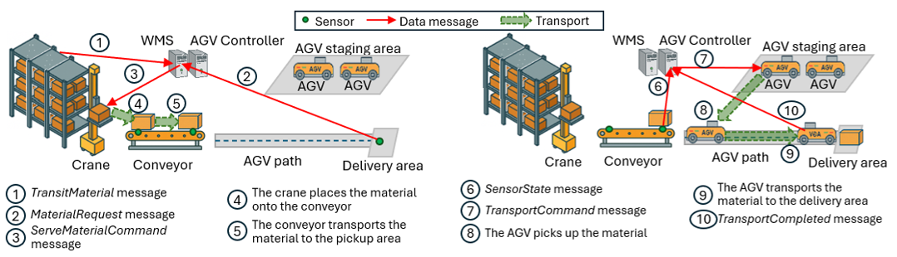
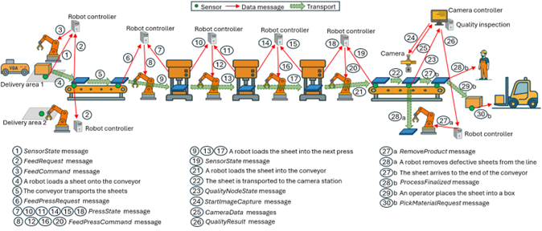

# Industrial Data

The datasets capture the data generated across an entire plant. All processes in the industrial plant are fully automated and rely on the exchange of information among system components, including robots, machines, sensors, actuators, and control systems. This file describes the data messages exchanged between the industrial components of the plant.

Figure 1 illustrates the data exchange among the devices and nodes involved in the storage warehouse, and Figure 2 illustrates the data exchange during the manufacturing of a steel sheet in a production line. For clarity, only aperiodic messages are shown. Messages are annotated with numerical labels. Thick green arrows illustrate transport operation. The Warehouse Management System (WMS) and the AGV controller are software entities and are depicted as separate computational nodes solely for illustrative purposes; in a real deployment, they may be hosted on the same node in Figure 1. In Figure 2, robot controllers are shown as separate computational nodes for clarity, although they may be deployed on the same or different nodes in practice. Please, refer to [1] for a detailed explanation of the data exchange in the industrial plant.

  

  <em>Figure 1. Messages flow in the storage warehouse.</em>

  

  <em>Figure 2. Message flow in a production line.</em>

We adopt 3GPP TS 22.104 use cases to establish the characteristics and requirements of the messages exchanged in our industrial plant scenario. The messages along with their characteristics and requirements are presented in next table. The table indicates, for each message, the corresponding use case that has been considered to establish its characteristics and communication requirements. The table also identifies for each message its origin and destination, size, latency and reliability requirement. In addition, the table indicates which messages require an acknowledgement from the destination and the period for periodic messages. 

**TABLE I. COMMUNICATION CHARACTERISTICS OF INDUSTRIAL MESSAGES**

| Message | Description | Origin | Destination | Size (bytes) | Latency (ms) | Reliability (%) | ACK | Period (ms) | Related Use Case in 3GPP TS 22.104 |
|--------|-------------|--------|-------------|--------------|---------------|------------------|-----|--------------|--------------------------|
| TransitMaterial | Sensor updates | Sensor in a storage cell | WMS | 64 | 100 | 99.99 | yes | – | Process and asset monitoring |
| ServeMaterialCommand | Command to collect material from a storage cell | WMS | Crane | 1 kB | 50 | 99.9999 | yes | – | Control-to-Control (UC2) |
| SensorState | Sensor updates | Sensor in the conveyor | AGV Controller / Robot controller | 40 | 50 | 99.9999 | yes | – | Control-to-Control (UC2) |
| CraneStatusReport | Periodic crane status report | Crane | WMS | 1 kB | 50 | 99.9999–99.999999 | yes | 50 | Control-to-Control (UC2) |
| MaterialRequest | Material request by the production line | Sensor in the delivery area | WMS | 1 kB | 50 | 99.9999 | yes | – | Control-to-Control (UC2) |
| TransportCommand | Assignment of a transport task | AGV Controller | AGV | 1 kB | 50 | 99.9999 | yes | – | Control-to-Control (UC2) |
| AGVStatusReport | Periodic AGV status report | AGV | AGV Controller | 250 | < period | 99.9999 | – | 100 | Mobile robot (UC3) |
| TransportCompleted | Report of a completed transport task | AGV | AGV Controller | 1 kB | 50 | 99.9999 | yes | – | Control-to-Control (UC2) |
| StorageStatistics | Shelves statistics | Crane Controller | CMS | 1 MB | 500 | 99.99 | yes | 60 s | Process and asset monitoring |
| TransportStatistics | AGVs statistics | Crane Controller | CMS | 1 MB | 500 | 99.99 | yes | 60 s | Process and asset monitoring |
| FeedRequest | Indicates that a steel sheet can be loaded onto the conveyor | Input line conveyor | Input line robot controller | 40 | 50 | 99.9999 | yes | – | Control-to-Control (UC2) |
| FeedCommand | Command to load a steel sheet onto the conveyor | Input line robot controller | Input line robotic arm | 40 | 50 | 99.9999 | yes | – | Control-to-Control (UC2) |
| RobotState | Periodic robotic arm status report | Input line robotic arm | Input line robot controller | 1 kB | < period | 99.9999 | – | 50 | Control-to-Control (UC2) |
| FeedPressRequest | Conveyor sensor update | Input line conveyor | Feed press robot controller | 40 | 500 | 99.9999 | yes | – | Control-to-Control (UC2) |
| PressState | Press status report | Press | Feed press robot controller | 1 kB | 50 | 99.9999 | yes | – | Control-to-Control (UC2) |
| FeedPressCommand | Command to load or transfer a steel sheet between presses | Robot controller | Robotic arm | 1 kB | 50 | 99.9999 | yes | – | Control-to-Control (UC2) |
| ConveyorState | Conveyor sensor update | Output line conveyors | Feed press robot controllers | 40 | 50 | 99.9999 | yes | – | Control-to-Control (UC2) |
| SheetInQualityControlArea | New processed sheet in quality control area | Quality control sensor | Camera controller | 40 | 50 | 99.9999 | yes | – | Control-to-Control (UC2) |
| StartImageCapture | Quality camera commands | Camera controller | Camera | 1 kB | 50 | 99.9999 | yes | – | Control-to-Control (UC2) |
| CameraData | Captured images for quality control | Camera | Quality control computer | 7527.6 kB | 100 | 99.9 | yes | – | – |
| QualityResult | Sheet does not meet quality standards | Quality control computer | Robotic arm controller | 1 kB | 50 | 99.9999 | yes | – | Control-to-Control (UC2) |
| RemoveProduct | Command to remove faulty steel sheet | Robotic arm controller | Robotic arm | 1 kB | 50 | 99.9999 | yes | – | Control-to-Control (UC2) |
| ProcessFinalized | Processed sheet at end of press line | End-of-line sensor | Shipping warehouse WMS | 40 | 50 | 99.9999 | yes | – | Control-to-Control (UC2) |
| RobotStatistics | Robot statistics | Robot controllers | CMS | 100 kB | 500 | 99.99 | yes | 60 s | Process and asset monitoring |
| PressStatistics | Press statistics | Presses | CMS | 100 kB | 500 | 99.99 | yes | 60 s | Process and asset monitoring |
| QualityControlStatistics | Quality control statistics | Camera controller | CMS | 100 kB | 500 | 99.99 | yes | 60 s | Process and asset monitoring |
| PickMaterialRequest | Request to store a box of steel sheets | Shipping warehouse sensor | Shipping warehouse WMS | 40 | 50 | 99.9999 | yes | – | Control-to-Control (UC2) |
| PickMaterialCommand | Command to pick and store a box | Shipping warehouse WMS | Crane | 1 kB | 50 | 99.999 | yes | – | Control-to-Control (UC2) |

---
# References

[1] XXXXX, "Open Industrial Datasets for Data-Driven Industrial Networks and Manufacturing Systems", in XXXX.

