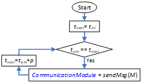
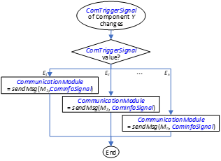
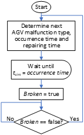
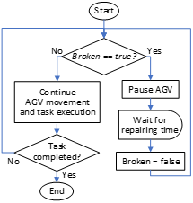

This directory contains the script-type behaviours developed in Visual Components to emulate the generation, exchange, and logging of data messages within the industrial plant scenario. It also includes the scripts used to model AGV malfunctions in the scenario.

# Data Message Generation and Logging

This directory contains the scripts-type behaviours developed in Visual Components to emulate the generation, exchange, and logging of data messages within the industrial plant scenario. These scripts overcome the limitation of Visual Components, which does not natively simulate data message exchanges between industrial assets, by introducing custom communication-related behaviours and a dedicated logging component.

The goal of these implementations is not to model the payload of messages, but to capture their **traffic patterns, timing, size, and communication requirements**, enabling the generation of realistic datasets representative of industrial communication systems.

---

## Overview of Implemented Components and Behaviours

The following elements are introduced and used throughout the scenario:

- **CommunicationModule** (signal-type behaviour): signal through which generated message information is exposed.
- **ComTriggerSignal** (signal-type behaviour): event trigger for aperiodic message generation.
- **ComInfoSignal** (signal-type behaviour): auxiliary signal used to dynamically update message parameters.
- **CommunicationModuleScript** (script-type behaviour): core logic for message generation.
- **MessageLogger** (custom component): collects and logs all generated messages, positions, and states.

These elements interact with existing component behaviours to generate both periodic and aperiodic (event-driven) data messages and to store them in structured datasets.

To incorporate the new data message generation functionality into a component, the following steps must be followed:

1. Create and add the **CommunicationModule**, **ComTriggerSignal**, and **ComInfoSignal** signals to the component.
2. Create a new script-type behaviour for the component and copy the code in the **CommunicationModuleScript** file provided in this repository.
3. Edit the list of messages in the CommunicationModuleScript for the particular component. 

Finally, add the MessageLogger component to the scenario.

## CommunicationModuleScript

The CommunicationModuleScript handles the generation of data messages within the scenario. It encapsulates all the logic required to define, generate, and expose communication messages (periodic and aperiodic) associated with a given component. The script operates according to the following three main steps.

**1. Message Definition**

Each instance of the CommunicationModuleScript defines a list of the messages that the corresponding component is able to transmit. For each message, a set of parameters is configured:

- Message identifier
- Origin and destination components
- Message size
- Generation type (periodic or aperiodic)
- Periodicity (for periodic messages)
- Latency and reliability requirements
- Acknowledgement (ACK) requirement

The values of these parameters are derived from industrial traffic models specified by 3GPP. 

**2. Generation of Periodic Messages**

Periodic messages are generated within the OnRun() method of the CommunicationModuleScript, which is executed continuously during the simulation runtime. For each periodic message, the script keeps track of its next generation time.

The sendMsg() method writes the message metadata into the CommunicationModule signal of the component. Any other component connected to this signal can access the message information whenever the signal value is updated. This mechanism is used by the MessageLogger to collect and store all periodic messages generated in the scenario.

  

  <em>Figure 1. Diagram flow of the generation of periodic messages in the OnRun() method of the CommunicationModuleScript.</em>

**3. Generation of Aperiodic Messages**

Aperiodic messages are generated in response to events occurring during the simulation, such as sensor activations, state transitions, or requests received from other components.

When such an event occurs, the component updates the ComTriggerSignal with a value identifying the event type. Any CommunicationModuleScript connected to this signal automatically executes its OnSignal() method upon detecting the change.

Inside the OnSignal() method, the script determines which message should be generated based on the received event identifier and then invokes the sendMsg() method. As in the periodic case, the message metadata is written to the CommunicationModule signal, making it available to all connected components.

  

  <em>Figure 2. Diagram flow of the generation of aperiodic messages in the OnSignal() method of the CommunicationModuleScript.</em>

While most message parameters are statically defined, some messages require parameters that vary at runtime. A representative example is the AGV controller, which sends task assignment messages to different AGVs. Although these messages share identical characteristics, their destination changes depending on the assigned AGV.

The ComInfoSignal is used to dynamically update the varying parameter (e.g., the destination AGV identifier). The value of ComInfoSignal is passed to the sendMsg() method and incorporated into the generated message. The CommunicationModuleScript interprets the meaning of ComInfoSignal according to the specific message being generated.

---

## Message Logging and Dataset Generation

The `MessageLogger` is a dedicated component developed to collect and store all relevant information generated during the simulation. It includes several script-based behaviours responsible for logging different types of data into CSV files. 
To create and add the MessageLogger to the layout, a basic component (for example, a cube) must first be inserted into the scenario. This basic component is then extended by adding the following behaviours in order to transform it into the MessageLogger component:

### `Get&ConnectCommunicationModules` and `CommCollector` behaviours

The `Get&ConnectCommunicationModules` behaviour establishes connections between the `CommunicationModule` signal of every component in the scenario and the `CommCollector` behaviour within the `MessageLogger`. These connections are created at the start of the simulation through the `OnStart()` method.

Each time a component generates a new message and updates its `CommunicationModule` signal, the `OnSignal()` method of the `CommCollector` behaviour is triggered. The message metadata is then read and logged into the `data_communications.csv` file following a predefined format.

### `PositionCollector` behaviour

The `PositionCollector` behaviour tracks the position and orientation of all components in the scenario. At the start of the simulation, the initial position and orientation of every component are logged to the `data_positions.csv` file. During execution, the behaviour periodically checks the current position and orientation of all components. If the position of a component changes by more than a configurable threshold, a new entry is logged. In the provided datasets, positions are checked every 0.5 seconds and logged when the displacement exceeds 1 mm.

### `StateCollector` behaviour

Operational states of components are logged by the `StateCollector` behaviour. Components that may transition between different states include a statistics-type behaviour that updates their operational state during execution. The `StateCollector` periodically monitors these state variables and logs a new entry in the `data_states.csv` file whenever a change is detected.

### AGV Malfunctions Events

In addition to the centralized logging, each AGV independently logs malfunction and repair events. These events are generated by the `FailureScript` behaviour of each AGV and detected by the corresponding `ResourceScript` behaviour. Whenever a malfunction occurs or is resolved, the event is recorded in a dedicated file named `data_Failures_AGV#Y.csv`, where `#Y` identifies the AGV. The logged data follow the same format conventions used for the rest of the dataset. More information on the implementation of AGV malfunctions is provided in: [Visual-Components_Industrial-Plant-Layout repository](https://github.com/uwicore/Visual-Components_Industrial-Plant-Layout).

---

## Output Files

The scripts in this directory generate the following CSV files:

- `data_communications.csv`: logged communication messages
- `data_positions.csv`: component positions and orientations
- `data_states.csv`: component operational states
- `data_Failures_AGV#Y.csv`: AGV-specific failure and repair events

# AGV Operation Malfunctions

This section describes the modelling of AGV malfunctions in the industrial plant. The scripts developed and incorporated into the AGV components in Visual Components are available in this folder: [`AGV malfunctions`](AGV%20malfunctions/).

An AGV malfunction may result from the failure of any of its components or subsystems, including the drive unit, AGV software control system, laser navigation system, safety systems, attachments, battery, brake system, and steering system [1]. The probability of a malfunction occurring within a given time interval Δt follows an exponential distribution, e−λΔt, where λ denotes the failure rate. The failure rate λ is equal to 1/MTBF, where MTBF is the mean time between failures. When a malfunction occurs, the AGV halts and remains unavailable until it is repaired. The repair time also follows an exponential distribution, e−λΔt, where MTTR is the mean time to repair. Table I summarizes the failure rates for the different AGV subsystems [1].

**Table I. AGV system failures.**

| AGV subsystem | Failure rate (failures/year) | MTBF (years) | MTTR (minutes) |
|---------------|------------------------------|--------------|----------------|
| AGV software control system | 6 | 0.167 | 30 |
| Attachments | 2 | 0.5 | 30 |
| Traction system (battery, brake, steering) | 1.7 | 0.588 | 60 |
| Drive unit | 1.5 | 0.667 | 40 |
| Laser navigation system | 0.875 | 1.143 | 60 |
| Safety system | 0.375 | 2.667 | 40 |

To implement malfunctions, a new script-type behaviour called `failuresScript` and a new property named `Broken` were added to the AGV component in Visual Components. The `failuresScript` models the occurrence of AGV failures according to exponential probability distributions based on the MTBF and MTTR values shown in Table I.

The probability distributions are initialized in the `OnStart()` method of the `failuresScript`. The occurrence of malfunctions is simulated in the `OnRun()` method, which determines the time of occurrence, the type of malfunction, and the corresponding repair time. When a malfunction occurs, the `Broken` property is set to `true`, the execution of the AGV tasks is interrupted, and the AGV remains paused until the repair is completed. Figure 3(a) illustrates the workflow of the `OnRun()` method, where *Tsim* denotes the simulation time.

The AGV operation and movement are modelled in the `ResourceScript` behaviour. The `OnSimulationUpdate()` method updates the AGV state according to its assigned transport task and continuously checks the value of the `Broken` property. When this property is set to `true`, the AGV is immediately stopped. Figure 3(b) presents a diagram of the overall implementation of AGV malfunctions. Changes done in the `ResourceScript` behaviour are described in the `Changes in ResourceScript` file. 

Malfunctions in AGVs can be enabled or disabled using a new property defined in the AGV component called `FailureSimulationEnabled` ( 1 -> enabled, 0 -> disabled).

  

  <em>(a) OnRun() method in the FailureScript.</em>

  

  <em>(b) OnSimualtionUpdate() method in the ResourceScript.</em>

  <em>Figure 3. Implementation of AGV malfunctions.</em>

The `failuresScript` behaviour is available in the folder: [`AGV malfunctions`](AGV%20malfunctions/). Instructions on how to modify the `ResourceScript` behaviour are also provided in the same folder.

# References

[1] R. Yan, L. M. Jackson, and S. J. Dunnett, “Automated guided vehicle mission reliability modelling using a combined fault tree and Petri net approach,” *International Journal of Advanced Manufacturing Technology*, vol. 92, pp. 1825–1837, 2017.

